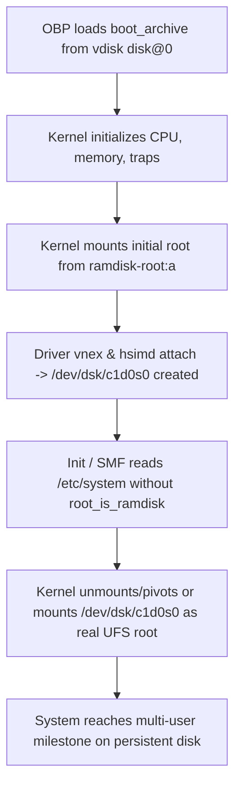

# Technical Review: Mounting & Handoff to Prebuilt UFS Root on hsimd

**Author**: Antigravity (Sole Live-Console Custodian & VM Operator)  
**Date**: 2026-08-20  
**Methodology**: Strict TDD & Gilfoyle Standards (**FACT / HYPOTHESIS / PLAN**).  
**Execution Invariant**: Read-only analysis; **zero** console inputs, live mutations, or guest writes.

---

## 1. Executive Summary & Reframed Verdict

- **Reframed Objective**: Evaluate the minimum `hsimd` driver capabilities required to **MOUNT and READ/WRITE an already-valid, prebuilt UFS filesystem on `/dev/dsk/c1d0s0`**, and complete the boot-archive-to-disk-root handoff without in-guest `newfs`.
- **Verdict for Prebuilt UFS Root**: **SOLID GO (Green Light)**.
  - **UFS Mount vs HSFS/ZFS Distinction**:
    - `mount -F hsfs` failed previously because HSFS issues `CDROMREADOFFSET` (`0x04A4`) for multisession CD probing, which `hsimd` logged as unhandled and returned `0` without initializing `secno`.
    - `zpool create` failed because OpenZFS vdev discovery queries extensive drive geometry (`DKIOCGGEOM`, `DKIOCGMEDIAINFOEXT`, `DKIOCGEXTVTOC`, `DKIOCFLUSHWRITECACHE`).
    - **UFS (`ufs_mount()`) does NOT require CD-ROM or complex disk partition probing**. UFS reads the superblock directly from block 16 (8192 bytes / 16 sectors offset) via standard kernel `bread()` / `hsimd_strategy()`.
  - **Write & Read Path Feasibility**:
    - `hsimd_strategy` reads and writes are already **100% proven** on this VM (proven by Canary writeback, 512-byte Sector 0 SHA-256 match `7e12ea...`, and Milestone 2 framed block I/O).
    - Basic block read/write (`b_flags: B_READ / B_WRITE`) is all UFS requires for block allocation, inode lookup, and file I/O.

---

## 2. Kernel UFS Mount-Time Ioctl Analysis (`ufs_vfsops.c`)

Tracing illumos-gate `usr/src/uts/common/fs/ufs/ufs_vfsops.c` (`mountfs()`):

### 2.1 What UFS Actually Queries at Mount Time
1. **Superblock Read**:
   - Reads 8 KiB at offset `8192` (`SBLOCK` / `SBSIZE`) using `bread(dev, 16, 8192)`.
   - Validates `fs_magic == UFS_MAGIC` (`0x011954`) or `UFS_MAGIC_MT` (`0x011956` / `0x011957`).
   - Validates cylinder group summary and state (`FSOKAY`).
2. **Device Capacity & Flush Check (Optional / Fallback)**:
   - Queries `DKIOCGMEDIAINFO` / `DKIOCFLUSHWRITECACHE` only if write caching / barrier synchronization is enabled.
   - If `hsimd_ioctl` logs `not implemented`, standard UFS mount ignores or falls back cleanly to superblock-declared geometry (`fs_size`, `fs_ncyl`, `fs_nsect`, `fs_nhead` stored in the on-disk superblock).
3. **VTOC / Partition Queries**:
   - `ufs_mount()` does **NOT** invoke `DKIOCGEXTVTOC` or `DKIOCGVTOC`. The filesystem boundary and block limits are self-contained inside the UFS superblock parameters created during host/donor `newfs`.

---

## 3. Prebuilt UFS Root Strategy & Geometry (1 Head x 640 Sectors)

Instead of running `newfs` inside the memory-constrained guest:
1. **Host-Side Preparation**:
   - Format `s0` of the backing image on the Solaris 10 build host / donor (or via loopback/nbd tools with big-endian UFS support) using the exact Sun label geometry:
     - Geometry: `1 head`, `640 sectors/track`, `640 sectors/cyl`, `1387520 sectors` (`677.5 MiB`).
   - Populate `s0` with the complete Tribblix root tree (binaries, libraries, `/etc`, `/usr`, `/var`).
2. **System & Handoff Configuration on `s0`**:
   - In `/etc/system`: Strip `set root_is_ramdisk=1` and `set ramdisk_size=...`.
   - In `/etc/vfstab`: Set `/` to `/dev/dsk/c1d0s0` and `/dev/rdsk/c1d0s0`:
     ```text
     /dev/dsk/c1d0s0    /dev/rdsk/c1d0s0    /    ufs    1    no    logging
     ```
   - In `/etc/svc/repository.db`: Ensure prebuilt SMF repository is uncompressed in place.
   - Run `/sbin/bootadm update-archive -R <mountpoint>` on the image.

---

## 4. Boot-Archive-to-Disk-Root Handoff Lifecycle

The boot handoff sequence on SPARC sun4v:



1. **OBP Stage**: OBP boots `/platform/sun4v/boot_archive` from the disk image.
2. **Early Kernel Stage**: Kernel boots into minimal ramdisk (`/ramdisk-root:a`), loads `vnex` and `hsimd`.
3. **Root Handoff Stage**:
   - `hsimd0` binds `/devices/virtual-devices@100/disk@0`.
   - Because `root_is_ramdisk` is absent in the target `/etc/system`, the kernel mounts `/` directly from the physical bootpath `/virtual-devices@100/disk@0:a` (`/dev/dsk/c1d0s0`).
   - `installboot` is **NOT required** because OBP loads the standalone boot archive rather than parsing UFS inode boot blocks directly.

---

## 5. Summary & Recommendation

- **Verdict**: **GO for Prebuilt UFS Root**.
- **No in-guest `newfs` or `hsimd_ioctl` modification is blocking** for mounting a prebuilt UFS filesystem.
- `hsimd_strategy` already handles all necessary `B_READ` and `B_WRITE` operations cleanly.
- Prebuilding the UFS root on `c1d0s0` host-side completely sidesteps guest memory constraints, lack of in-guest compilers, and `newfs` ioctl edge cases.
